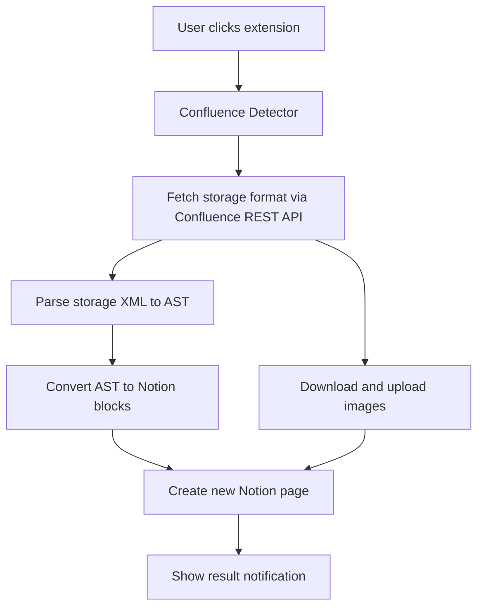

# SPEC: Confluence-to-Notion Chrome Extension

Path: Projects > 个人工作知识库建设
Status: Draft
Owner: TBD
Last updated: 2026-05-18

## 1. 规范语言

本文用词含义：

- MUST：实现和验收必须满足。
- SHOULD：默认应满足；如不满足，必须有明确原因和可见降级。
- MAY：允许实现，但不作为 V1 验收门槛。
- Implementation-defined：实现可以自行决定，但必须在代码或配置中保持一致。

## 2. 问题陈述

团队知识主要沉淀在 Confluence Server / Data Center 页面里，个人知识库和 AI 工作流正在迁移到 Notion。现有工具缺一个按需、单页、保真剪藏能力：用户打开一篇 Confluence 页面，点击 Chrome Extension，就能保存到自己的 Notion workspace。

普通网页剪藏不适合：

- Confluence 页面常用 Mermaid、Code、Info/Warning、Expand、Draw.io 等宏。DOM 抓取只能拿到渲染结果，会丢失 Mermaid 源码、宏语义和折叠结构。
- 内网图片、附件、截图通常托管在 Confluence 内网。Notion 服务器无法直接访问这些 URL，必须由用户浏览器带 cookie 下载后再上传到 Notion。
- 批量迁移工具面向 space 或全站迁移，不适合“看到一篇有用文档就保存一篇”的个人工作流。

V1 目标不是通用 web clipper，也不是企业级 Confluence-to-Notion 迁移系统。边界是：把当前打开的 Confluence 单页，尽可能保真地保存到用户自己的 Notion。

## 3. 目标和非目标

### 3.1 目标

V1 MUST 支持：

- 用户在 Options UI 中配置 Notion Personal Access Token / Internal Integration Token；V1 不支持 Notion OAuth。
- 用户配置一个自己的 Confluence Server / Data Center 7.13.7 base URL，并显式授予对应 host permission。
- 用户选择默认 Notion 保存目标：database 或 page；两种 target 都是 V1 MUST 支持。
- 用户在 Confluence 页面手动点击保存。
- 扩展通过 Confluence REST API 读取 storage format，而不是用 DOM-to-Markdown 作为主路径。
- Mermaid 宏保存为 Notion code block，language 优先使用 `mermaid`。
- Code / noformat 宏保留代码内容和语言标记。
- Info / Note / Tip / Warning 宏映射为 Notion callout。
- Expand 宏映射为 Notion toggle，并尽量递归转换内部内容。
- 内网图片、附件图片、Draw.io 渲染图由浏览器下载后上传到 Notion。
- Confluence 原始 URL、space、labels、last modified 等 metadata 保存到 Notion。
- 每次保存 Confluence 页面时都创建新的 Notion 页面，不查找或更新旧页面。
- 大页面保存任务在后台运行；popup 关闭不取消任务。
- 内容保真问题局部降级，不因单个图片、宏、表格失败而中断整页保存。

### 3.2 非目标

V1 MUST NOT 做：

- 非 Confluence 页面的通用网页剪藏。
- Confluence Cloud 支持。
- Confluence space、page tree 或全站批量迁移。
- 双向同步。
- 增量同步或定时同步。
- Confluence comments、permissions、version history、audit history 同步。
- 复杂表格、合并单元格、彩色表头的完全保真。
- Draw.io 源文件的可编辑导入。
- Notion-to-Confluence 导出。
- 多个 Confluence base URL 或多实例切换。
- 多用户管理后台或集中策略管理。

## 4. 系统概览

### 4.1 用户流程

```text
安装扩展
  -> 配置 Notion Internal Integration Token
  -> 配置 Confluence base URL
  -> 授予 host permission
  -> 选择 Notion database/page 目标
  -> 打开 Confluence 页面
  -> 点击保存
  -> 后台读取 storage XML、转换、上传图片、写入 Notion
  -> 展示成功、失败、降级 warning
```

### 4.2 主流程



### 4.3 主组件

| Component | Responsibility |
| --- | --- |
| Popup UI | 展示当前页面状态、目标、保存按钮、任务进度和结果摘要。 |
| Options UI | 配置 Notion Internal Integration Token、Confluence base URL、host permission、默认保存目标。 |
| Background Task Runner | 执行保存任务，维护进度、warning、失败状态；popup 关闭后继续运行。 |
| Confluence Detector | 判断当前 tab 是否为已配置 Confluence 实例内的支持页面，并解析 page identity。 |
| Confluence Storage Fetcher | 用浏览器会话 cookie 拉取 storage XML、metadata、attachments。 |
| Storage XML Parser | 安全解析 Confluence storage XML，生成内部 AST。 |
| Macro Mapper | 将已知 Confluence 宏映射为 Notion blocks；未知宏降级。 |
| Asset Handler | 下载 Confluence 图片/附件/Draw.io 渲染图，并上传到 Notion。 |
| Notion Target Manager | 管理 database/page target。 |
| Notion Writer | 创建新的 Notion 页面，按 API 限制批量写入 blocks。 |

### 4.4 外部依赖

| Dependency | Use | Failure impact |
| --- | --- | --- |
| Chrome Extension MV3 APIs | token storage、permissions、notifications、tabs、service worker | 失败则无法授权、保存或展示任务结果。 |
| Confluence Server / Data Center REST API | 读取页面 storage format、metadata、attachments | 拉取失败则整页保存失败。 |
| Browser session cookie | 访问内网 Confluence 内容 | cookie 失效或无权限则整页保存失败。 |
| Notion API + Internal Integration Token | 创建页面、写入 blocks、上传文件 | 认证或写入失败则整页保存失败。 |
| Notion File Upload API | 上传内网图片和 Draw.io 渲染图 | 单个文件失败只产生 warning。 |

## 5. 核心领域模型

### 5.1 实体

| Entity | Key fields | Meaning | Owner |
| --- | --- | --- | --- |
| `ConfluencePageRef` | `baseUrl`, `pageId`, `pageUrl` | 当前 Confluence 页面身份。 | Confluence Detector |
| `ConfluencePageData` | `title`, `bodyStorageXml`, `metadata`, `attachments` | REST API 返回的页面内容和元数据。 | Storage Fetcher |
| `NotionTarget` | `type`, `id`, `displayName` | 用户选择的保存位置，type 为 `database` 或 `page`。 | Target Manager |
| `ClipTask` | `taskId`, `pageRef`, `target`, `status`, `progress`, `warnings` | 一次保存任务。 | Background Task Runner |
| `AssetRef` | `sourceUrl`, `filename`, `mimeType`, `size`, `notionFileRef`, `status` | 图片、附件、Draw.io 渲染图。 | Asset Handler |
| `Degradation` | `type`, `source`, `message`, `severity` | 局部降级记录，用于结果摘要。 | Converter / Writer |

### 5.2 标识和归一化

- `baseUrl` MUST 归一化为 origin + optional context path，不保留末尾 `/`。
- `pageId` MUST 来自 Confluence 页面 ID；缺失时 MAY 用 DOM metadata 辅助提取。
- `pageUrl` MUST 保存用户可打开的原始页面 URL。
- `lastModified` MUST 保存为 ISO 8601 字符串；展示时 MAY 使用用户本地时区。
- Labels MUST 去重，并保留 Confluence 返回的原始大小写。
- Attachment filename SHOULD 保留原名；上传到 Notion 时如需改名，必须保持可追溯。

### 5.3 ClipTask 状态

| Status | Meaning | Terminal |
| --- | --- | --- |
| `idle` | 无任务。 | No |
| `detecting` | 正在识别当前页面。 | No |
| `fetching` | 正在读取 Confluence storage format。 | No |
| `parsing` | 正在解析 XML。 | No |
| `converting` | 正在生成 Notion blocks。 | No |
| `uploading_assets` | 正在上传图片和附件。 | No |
| `writing` | 正在创建 Notion 页面。 | No |
| `succeeded` | 页面保存成功，可能有 warning。 | Yes |
| `failed` | 页面保存失败。 | Yes |
| `cancelled` | V1 不提供用户取消；保留给后续版本。 | Yes |

## 6. 配置和权限合同

### 6.1 Notion Personal Access Token / Internal Integration Token

- V1 MUST 使用用户提供的 Notion Personal Access Token / Internal Integration Token。
- V1 MUST NOT 实现 Notion OAuth、OAuth client ID、OAuth redirect URI、OAuth scopes、authorization code exchange、access token refresh 或 refresh token storage。
- The SPEC does not fix a specific `Notion-Version`; implementation MUST choose a Notion API version according to current Notion documentation at implementation time and record it in extension configuration or release notes.
- Notion token MUST 存在 `chrome.storage.local`。
- Notion token MUST NOT 存在 `chrome.storage.sync`。
- Content script MUST NOT 接收 Notion token。
- Background service worker MUST 是唯一附加 Notion `Authorization` header 的扩展上下文。
- Token 缺失、无效、被撤销或无权访问选定 target 时，扩展 MUST fail early，并提示用户更新 token 或在 Notion 中 share 目标 page/database 给该 integration。
- Logout MUST 清理本地 Notion token、当前 workspace 信息、默认 target 和最近一次 terminal `ClipTask` 结果摘要。
- Logout MUST NOT 清理 Confluence base URL 或主动移除已授予的 Confluence host permission。

### 6.2 Confluence 配置

- 扩展 MUST NOT 内置默认 Confluence 实例。
- 用户 MUST 手动配置一个 Confluence Server / Data Center base URL。
- Confluence base URL MUST be an absolute `http` or `https` URL containing origin plus optional context path, such as `https://confluence.example.com` or `https://example.com/wiki`.
- Confluence base URL MUST NOT contain query string, fragment, username, password, or trailing `/` after normalization.
- Confluence base URL normalization MUST preserve the context path when present.
- 配置 base URL 后，扩展 MUST 通过 `chrome.permissions.request` 请求对应 origin 的 optional host permission。
- Because Chrome MV3 requires runtime-requestable host permissions to be predeclared in the manifest, `optional_host_permissions` MAY declare only `http://*/*` and `https://*/*` as candidate host patterns; actual runtime `chrome.permissions.request` calls MUST request only the configured Confluence origin.
- 用户修改 Confluence base URL 时，扩展 MUST 请求新 origin 的 host permission。
- 用户修改 Confluence base URL 后，扩展 MUST NOT 使用旧 normalized base URL 或旧 origin 进行页面检测、REST fetch 或 asset download。
- 用户修改 Confluence base URL 后，扩展 MUST NOT 主动移除旧 origin host permission。
- Chrome host permission MUST be requested at origin granularity only; context path restrictions for page detection and Confluence REST content fetch MUST be enforced by extension code using the normalized base URL.
- 扩展 MUST NOT detect pages or fetch Confluence REST content outside the configured normalized base URL path.
- Asset Handler MAY download same-origin attachment, image, and Draw.io render URLs outside the normalized base URL path when those URLs are referenced by the Confluence storage XML or attachment metadata.
- 未授予 host permission 时，扩展 MUST NOT 对该 origin 运行检测或 REST fetch。
- 扩展 MUST NOT 请求 `cookies` permission。
- Confluence 请求 MUST 使用 `fetch(url, { credentials: 'include' })` 依赖浏览器会话。

### 6.3 Notion 保存目标

- 用户 MUST 选择默认 `NotionTarget` 后才能保存。
- Options UI MUST list searchable page and database targets accessible to the configured Notion integration token.
- Options UI MUST NOT 展示扩展无权访问的 Notion page 或 database。
- 目标列表为空时，Options UI MUST 提示用户在 Notion 中把目标 page 或 database share 给对应 integration，或检查 token 是否有效。
- 选择 target 时，扩展 MUST 验证 target type 为 `database` 或 `page`，并保存 `id`、`type` 和 `displayName`。
- 选择 database target 时，扩展 MUST 读取 database metadata，并保存 title property name / id。
- Target type MUST 为 `database` 或 `page`；V1 MUST 同时支持两种类型。
- Popup SHOULD 显示当前 target，并允许用户切换。
- Database target MUST NOT 自动创建或修改 metadata properties；metadata MUST 写入页面正文顶部。
- Page target MUST 把 metadata 写入页面正文顶部。

## 7. Confluence 输入合同

### 7.1 支持版本

- V1 MUST support Confluence Server / Data Center 7.13.7.
- Support for other Confluence Server / Data Center versions is best effort and not a V1 acceptance gate.
- Confluence Cloud is out of scope.

### 7.2 页面检测

Detector MUST 只匹配已配置的 Confluence base URL，包括其 context path。即使 Chrome host permission 覆盖整个 origin，Detector 和 Fetcher 也 MUST NOT 对 normalized base URL path 之外的页面或 REST content 运行。

V1 MUST 支持以下 URL 形态：

- `/pages/viewpage.action?pageId={pageId}`
- `/display/{SPACE}/{Page+Title}`
- `/spaces/{SPACE}/pages/{pageId}`

当 URL 不含 pageId 时，Detector SHOULD 从 DOM metadata 或页面内 Confluence bootstrap 数据中提取 pageId。若仍无法提取，MUST 失败并提示“不支持或无法识别的 Confluence 页面”。

### 7.3 Storage format 拉取

Fetcher MUST 调用：

```text
GET /rest/api/content/{pageId}?expand=body.storage,metadata.labels,version,space,children.attachment
```

Fetcher MUST 输出：

```ts
type ConfluencePageData = {
  title: string
  bodyStorageXml: string
  metadata: {
    originalUrl: string
    space: string
    labels: string[]
    lastModified: string
  }
  attachments: Attachment[]
}
```

Fetcher MUST 把 HTTP 401/403 映射为认证或权限失败。Fetcher MUST 把 404 映射为页面不存在或无权限。Fetcher MUST 把 5xx 和网络错误映射为 Confluence 临时失败。

## 8. XML 解析和转换合同

### 8.1 XML 解析安全

Storage XML Parser MUST：

- 禁用外部实体解析和外部资源加载。
- 保留 Confluence namespace 信息，如 `ac:*`、`ri:*`。
- 不执行 XML、HTML、SVG、脚本或宏内容。
- Parser MAY read supported XHTML/storage tags as structured input, but MUST NOT preserve unsupported raw HTML as executable or renderable HTML in Notion.
- Unsupported inline HTML SHOULD be converted to plain text when text content is recoverable; otherwise it MUST create a `Degradation`.
- 把无法解析的局部节点转为 `Degradation`，除非整个 XML 无法解析。

整个 storage XML 无法解析时，任务 MUST 失败。

### 8.2 基础内容支持

Parser + Converter MUST 支持：

- Headings。
- Paragraphs。
- Links。
- Ordered / unordered lists。
- Nested lists。
- Inline formatting：bold、italic、strikethrough、inline code。
- Colored text best effort。
- Tables best effort。
- Images and attachments。
- `ac:structured-macro`。
- `ri:attachment`。
- `ri:url`。

### 8.3 宏映射

| Confluence macro | Notion output | Required behavior |
| --- | --- | --- |
| `mermaid` | Code block | Language SHOULD 为 `mermaid`；Notion 不接受时 MUST 降级为 plain text code，并标记 Mermaid。 |
| `code` | Code block | MUST 保留代码内容；SHOULD 保留 language。 |
| `noformat` | Code block | MUST 保留原文；language MAY 为空或 plain text。 |
| `info` / `note` / `tip` | Callout | MUST 保留正文；icon/color 可 implementation-defined。 |
| `warning` | Callout | MUST 保留正文；SHOULD 与普通 note 视觉区分。 |
| `expand` | Toggle | MUST 保留标题；SHOULD 递归转换内部内容。 |
| Draw.io | Image block + optional source link | MUST 导入渲染图；如果 source link 可得，SHOULD 保留 source link。 |
| Unknown macro | Callout | MUST 输出 `Unsupported Confluence macro: {name}` 和可提取正文文本；MUST NOT 输出宏参数。 |

Unknown macro MUST NOT 中断整页保存。

### 8.4 表格处理

V1 表格为 best effort。

MUST 支持：

- 普通行列。
- 单元格内基础 inline formatting。
- 单元格内 nested list 转为换行文本。

SHOULD 降级：

- `rowspan` / `colspan` 展平为重复或空单元格。
- 彩色表头忽略颜色。
- 复杂表格可降级为普通段落。

表格降级 MUST NOT 中断整页保存。

## 9. Asset 处理合同

### 9.1 图片和附件

Asset Handler MUST：

1. 从 storage XML 和 attachment metadata 解析图片 URL。
2. 仅对与 configured Confluence base URL same-origin 的 Confluence-hosted asset URL 使用 `credentials: 'include'` 下载。
3. 使用 Notion File Upload API 上传文件。
4. 用 Notion file reference 替换原图片引用。

规则：

- 从 storage XML 和 attachment metadata 解析出的 Confluence-hosted asset URL MUST be same-origin with the configured Confluence base URL.
- Same-origin asset URLs MAY be outside the normalized base URL path.
- Cross-origin asset URLs MUST NOT be downloaded with Confluence credentials.
- Cross-origin external image URLs MUST NOT be uploaded to Notion in V1.
- Cross-origin external image URLs SHOULD be emitted as Notion external image blocks when the URL appears directly usable by Notion; otherwise they MUST be preserved as ordinary link text or bookmark/link blocks.
- 图片上传并发 MUST 限制为 3。
- 单个图片失败 MUST NOT 中断整页保存。
- 上传失败时，页面正文 MUST 降级为普通文本或 bookmark/link block，文本包含原 Confluence 链接。
- 上传失败时，页面正文 MUST NOT 使用 Notion external image block 指向 Confluence 内网图片 URL。
- 最终结果 MUST 展示 warning count，例如 `Saved with 3 image warnings`。
- Clipped document MUST NOT 为每张失败图片增加错误 callout。
- Image caption MUST NOT 默认追加 source URL。
- 页面级 metadata MUST 保留 Original URL。

### 9.2 文件大小、时效和类型

- V1 MUST treat 20 MB as the maximum supported Notion file upload size.
- Files larger than 20 MB MUST NOT use multi-part upload in V1; Asset Handler MUST skip upload and preserve the original Confluence link as text or bookmark/link block.
- Notion-hosted uploaded file URLs expire after 1 hour; the extension MUST NOT persist uploaded file URLs as durable references.
- Uploaded files MUST be attached to Notion blocks within 1 hour of upload.
- If a file upload succeeds but cannot be attached within 1 hour, Writer MUST treat it as upload failure, preserve the original Confluence link, and add a warning.
- V1 MAY attach uploaded files only to compatible Notion block types: image、file、video、audio、pdf。
- V1 MUST NOT upload files into Notion files properties.
- V1 MUST NOT 压缩图片。
- V1 MUST NOT 因单个文件过大而失败整页任务。
- MIME type 无法确认时，Asset Handler SHOULD 根据响应 header 和文件名 best effort 判断；仍无法确认时 SHOULD 跳过上传并保留链接。

### 9.3 Draw.io

- Draw.io macro MUST 优先导入渲染图。
- 如果 source file link 可用，Converter SHOULD 在图片附近增加 source link。
- 如果渲染图导入失败，Converter MUST 保留原 Confluence 链接为普通文本或 bookmark/link block。
- V1 MUST NOT 要求 Draw.io 源文件在 Notion 中可编辑。

## 10. Notion 输出合同

### 10.1 输出格式

Converter MUST 直接生成 Notion blocks。Markdown MUST NOT 作为主中间格式，因为 Markdown 无法稳定表达 Notion callout、toggle、table、image、caption、nested blocks。

### 10.2 Database target

当 target 为 database：

- Notion Writer MUST 在选中 database 中创建新的 clipped page。
- Notion Writer MUST NOT 自动创建、修改或依赖 metadata properties。
- Notion Writer MUST use the saved database title property name / id to set the clipped page title.
- Notion Writer MUST NOT proactively re-read database metadata before each save solely to detect title property drift.
- If Notion page creation fails because the saved database title property, schema, or target permission is no longer valid, the task MUST fail early with a target-invalid message instructing the user to reselect the target.
- Notion Writer MUST 在 clipped page 顶部添加 `Confluence metadata` toggle。
- Toggle 内 MUST 包含 Original URL、Confluence Base URL、Confluence Page ID、Confluence Space、Labels、Last Modified、Last Clipped At。
- Database page 的 title property MUST 使用 Confluence page title，不追加 pageId、时间戳或其他去重后缀。

### 10.3 Page target

当 target 为 page：

- Notion Writer MUST 在选中 page 下创建新的 clipped page。
- Clipped page title MUST 使用 Confluence page title，不追加 pageId、时间戳或其他去重后缀。
- Notion Writer MUST 在 clipped page 顶部添加 `Confluence metadata` toggle。
- Toggle 内 MUST 包含 Original URL、Confluence Base URL、Confluence Page ID、Confluence Space、Labels、Last Modified、Last Clipped At。

### 10.4 重复保存

重复保存同一 Confluence 页面 MUST 创建新的 Notion page。

规则：

- Writer MUST NOT 查询 `chrome.storage.local` 中的历史页面映射来复用旧页面。
- Writer MUST NOT 为了去重而扫描 Notion workspace 或 database。
- Writer MUST NOT 更新、清空、归档或删除先前创建的 clipped page。
- 每次保存仍然 MUST 使用 Confluence page title 作为 Notion page title，并写入完整 metadata，包括 Original URL、Confluence Base URL、Confluence Page ID、Last Modified 和 Last Clipped At。
- Popup 和结果摘要 SHOULD 明确展示“已创建新 Notion 页面”，避免用户误以为覆盖了旧页面。

### 10.5 Block 写入

- Writer MUST 每批 append 不超过 100 blocks。
- Writer MUST 遵守 Notion nested block 限制；超出时 SHOULD 降级为扁平结构并记录 warning。
- Writer MUST 遵守 Notion rich_text 长度限制；超出时 SHOULD 拆分 blocks 或降级为 file/link。
- Notion rate limit 时，Writer SHOULD 按 Notion 响应做有限重试。
- 重试耗尽后，Writer MUST 失败任务并保留错误摘要。
- 如果 Writer 已创建 Notion page 但 block append 中途失败，Writer MUST NOT 自动 archive、删除或清空该 page。
- 如果部分写入失败时 Notion page URL 可得，结果摘要 MUST 包含该 URL，并标记为 partial write。

## 11. 后台任务和进度

- 保存操作 MUST 在 background service worker 中运行。
- ClipTask MUST have a 5-minute overall timeout measured from task start.
- On overall timeout, the task MUST transition to `failed`, release the single-task lock, and show a retryable timeout message to the user.
- All Confluence page fetch, asset download, and Notion API requests MUST use a 30-second per-request timeout.
- Retryable external request failures MUST be retried at most 2 times per request, bounded by the 5-minute overall task timeout.
- Retryable failures are network errors, HTTP 408, HTTP 429, and HTTP 5xx.
- HTTP 400, 401, 403, and 404 MUST NOT be retried, except where a specific API uses a documented retryable 4xx other than 408 or 429.
- Notion 429 retry SHOULD follow Notion response retry hints when available.
- 任意非终态 `ClipTask` 存在时，扩展 MUST NOT 启动第二个保存任务。
- 用户重复点击保存或在其他页面点击保存时，Popup MUST 显示既有任务进度，而不是创建新的 Notion page。
- V1 MUST NOT 实现并发保存或任务队列。
- Popup 关闭 MUST NOT 取消任务。
- Popup 打开时 MUST 显示当前阶段：fetch、parse、convert、upload images、write。
- 完成或失败 MUST 通过 browser notification 或 extension badge 告知用户。
- V1 不要求 service worker 终止后的任务恢复。
- ClipTask state MUST be persisted enough for the service worker to detect a previously non-terminal task after restart.
- On service worker startup, if a persisted non-terminal `ClipTask` exists, the extension MUST mark it as `failed`, release the single-task lock, and tell the user to retry.
- 如果 Chrome 终止 service worker 导致任务中断，扩展 MUST 把任务标为 failed，并提示用户重试。
- 用户重试 MUST 按一次新的保存任务处理；如果先前任务已部分创建 Notion page，V1 MUST NOT 尝试复用或清理该 page。
- V1 MUST 在本地保存最近一次 terminal `ClipTask` 结果摘要，直到下一次任务完成后覆盖或用户 logout 清理。

## 12. 失败模型和恢复

| Failure class | Example | Required behavior | Human action |
| --- | --- | --- | --- |
| Missing Notion token | 用户未配置 token 或 logout 后 token 被清理 | Fail early | 在 Options UI 配置 Notion Internal Integration Token。 |
| Invalid/revoked Notion token | Notion API returns unauthorized | 清理或标记本地 token 状态，fail early | 重新生成并配置 token。 |
| Notion target list empty | Configured integration has no accessible page/database | Fail target setup with guidance to grant access in Notion | 用户在 Notion 中把目标 page/database share 给该 integration。 |
| Missing target | 未选择 database/page | Fail early | 选择保存目标。 |
| Invalid/stale Notion database target | Saved database title property, schema, or target permission is no longer valid | Fail page creation with target-invalid message; do not proactively re-read metadata on every save | 重新选择保存目标。 |
| Invalid Confluence base URL | URL has query/hash/credentials or unsupported scheme | Fail setup with validation message | 输入有效的 Confluence base URL。 |
| Missing host permission | 未授予 Confluence origin 权限 | Fail early | 授予 host permission。 |
| Unsupported page | URL 不匹配或无法解析 pageId | Fail early | 打开支持的 Confluence 页面。 |
| Confluence 401/403 | cookie 失效、SSO 未登录、无权限 | Fail whole task | 登录 Confluence 或申请权限。 |
| Confluence fetch failed | 网络错误、5xx、REST 不可用 | Fail whole task | 稍后重试。 |
| XML parse failed | storage XML 整体不可解析 | Fail whole task | 查看错误摘要；必要时导出样本排查。 |
| Unsupported raw HTML | Storage contains unsupported inline/block HTML | Convert recoverable text to plain text or create degradation; never preserve executable/renderable raw HTML | 无需操作。 |
| Unknown macro | 不支持的 `ac:structured-macro` | Degrade to unsupported macro callout | 无需操作。 |
| Mermaid language rejected | Notion 不接受 `mermaid` | Degrade to plain text code | 无需操作。 |
| Cross-origin external image | Storage XML references non-Confluence image URL | Do not upload; emit Notion external image block if directly usable, otherwise preserve as link | 无需操作。 |
| Single image upload failed | 下载失败、上传失败、文件过大 | Preserve original Confluence link as text or bookmark/link block; add warning | 如需离线可读，手动处理图片。 |
| Draw.io import failed | 渲染图不可下载 | Preserve original Confluence link as text or bookmark/link block; add warning | 手动打开链接。 |
| Complex table unsupported | merged cells、复杂嵌套 | Best-effort flatten or paragraph fallback | 无需操作。 |
| Notion property creation denied | V1 不创建或修改 database properties | Not applicable | 无需操作。 |
| Oversized file | 文件超过 20 MB | Skip upload; preserve original Confluence link as text or bookmark/link block; add warning | 如需离线可读，手动处理文件。 |
| Expired Notion upload | 文件上传后 1 小时内未 attach | Treat as upload failure; preserve original Confluence link; add warning | 用户重试。 |
| Notion page creation failed | API 拒绝创建页面 | Fail whole task; if caused by stale database title property, schema, or target permission, report target-invalid | 检查 target 权限或重新选择 target。 |
| Notion write partially failed | block append 中途失败 | Fail task with partial-write warning; do not archive/delete/clear partial page; include Notion page URL if available | 用户可重试；重复保存会创建新页面。 |
| Service worker terminated | Chrome 回收后台任务 | Mark failed if detectable; on startup, persisted non-terminal tasks are marked failed and the single-task lock is released; retry creates a new save task and does not reuse or clean partial Notion pages | 用户重试。 |

## 13. 安全和隐私

- Notion tokens MUST 只保存在 `chrome.storage.local`。
- Content scripts MUST NOT 接收 Notion tokens。
- Confluence cookies MUST NOT 被扩展读取或存储；只允许浏览器通过 `credentials: 'include'` 自动携带。
- 扩展 runtime MUST 只请求用户配置的 Confluence origin 权限；页面检测和 REST content fetch 必须用 normalized base URL path 在代码中限制实际访问范围。
- Asset Handler MAY 下载 same-origin 且由 storage XML 或 attachment metadata 引用的附件、图片和 Draw.io 渲染图，即使资源路径在 normalized base URL path 之外。
- 扩展 MUST NOT 请求 `<all_urls>`。
- Manifest `optional_host_permissions` MUST NOT include `<all_urls>` and MUST NOT grant host access by itself; broad `http://*/*` and `https://*/*` entries are allowed only as MV3 candidate patterns for runtime optional permission requests.
- 扩展 MUST NOT 请求 `cookies` permission。
- 扩展 MUST NOT 执行 Confluence 页面中的脚本、HTML event handler、SVG script 或宏内容。
- Parser MUST 禁用 XML external entity 和外部资源加载。
- Error logs MUST NOT 记录 Notion token、cookie、完整 Notion API authorization header。
- V1 MUST NOT provide debug export.
- 开发模式 debug log MUST 默认脱敏 token、cookie、authorization header。
- 用户 logout MUST 清除 Notion token、workspace 状态、默认 target 和最近一次 terminal task 摘要。
- 用户 logout MUST NOT 清理 Confluence base URL 或主动移除 Confluence host permission。

## 14. 可观测性

V1 MUST 为每个 `ClipTask` 维护用户可见结果摘要。V1 MUST 只在本地保留最近一次 terminal task 摘要；下一次 terminal task MUST 覆盖它；logout MUST 清理它。

摘要字段：

- `taskId`
- source Confluence title and URL
- Notion target
- final status
- elapsed time
- block count
- asset count
- warning count
- Notion page URL if created
- first failure reason

V1 SHOULD 在开发模式提供结构化 debug log，但 MUST NOT 提供 debug export：

- stage start/end
- Confluence fetch status
- XML parse summary
- macro count by type
- asset upload summary
- Notion write batch summary

Debug log MUST 脱敏 secrets。

## 15. 测试和验证矩阵

### 15.1 Fixtures

测试 SHOULD 使用真实、脱敏的 Confluence storage XML fixtures。

Required fixtures：

1. `simple`
   - headings
   - paragraphs
   - links
   - lists
   - basic table
   - inline formatting
2. `macro-heavy`
   - Mermaid
   - code / noformat
   - info / note / tip / warning
   - expand with nested content
   - Draw.io macro
   - unsupported macro
3. `image-heavy`
   - attachment images
   - external images
   - broken image
   - more than one image batch

### 15.2 Automated tests

| Profile | Case | Expected result |
| --- | --- | --- |
| Core | Single Confluence base URL | Only one configured base URL is supported; changing it replaces the active configuration. |
| Core | Confluence base URL change | Requests new origin host permission; old origin is no longer used; old host permission is not actively removed. |
| Core | Logout retention | Clears Notion tokens/workspace/default target/last summary; keeps Confluence base URL and host permission. |
| Core | Result summary retention | Only the most recent terminal task summary is stored; next terminal task overwrites it; logout clears it. |
| Core | Normalize Confluence base URL with context path | Preserves context path, removes trailing slash, rejects query/hash/credentials. |
| Core | Notion target discovery | Lists searchable accessible pages and databases; inaccessible targets are not shown. |
| Core | Empty Notion target list | Shows guidance to grant integration access in Notion. |
| Core | Detect `viewpage.action?pageId=` URL | Extract correct `ConfluencePageRef`. |
| Core | Detect `/display/SPACE/Page+Title` URL with DOM metadata | Extract pageId or fail with unsupported page. |
| Core | Detect `/spaces/SPACE/pages/{id}` URL | Extract correct pageId. |
| Core | Parse simple fixture | Generate headings, paragraphs, links, lists, table blocks. |
| Core | Parse macro-heavy fixture | Generate expected code, callout, toggle, image/link fallback blocks. |
| Core | Unknown macro | Generate unsupported macro callout with macro name and recoverable body text; macro parameters are not emitted; task does not fail. |
| Core | Mermaid language rejected | Generate plain text code fallback and warning. |
| Core | Cross-origin external image | Does not upload; emits Notion external image if usable, otherwise preserves URL as link. |
| Core | Image upload failure | Preserve source URL as text or bookmark/link block; warning count increments; no per-image error callout. |
| Core | Image concurrency | No more than 3 concurrent uploads. |
| Core | Oversized file | Files over 20 MB are not uploaded; source URL is preserved; warning count increments. |
| Core | Expired upload attachment window | Upload not attached within 1 hour is treated as failed upload; source URL is preserved. |
| Core | Database target metadata | Metadata is written into the page body toggle; database properties are not created or modified. |
| Core | Database title property discovery | Selecting a database target reads database metadata and stores the title property name / id; saving uses the stored title property. |
| Core | Stale database target | If saved database title property, schema, or permission becomes invalid, page creation fails with target-invalid guidance. |
| Core | Re-save same page | Creates a new Notion page each time; previous clipped pages remain unchanged. |
| Core | Notion append batching | Writes blocks in batches of max 100. |
| Core | Request timeout and retry | Confluence page fetch, asset download, and Notion API requests use 30s per-request timeout; network errors, 408, 429, and 5xx retry at most 2 times within the 5-minute task timeout. |
| Core | ClipTask overall timeout | A task running longer than 5 minutes fails, releases the single-task lock, and shows retry guidance. |
| Core | Duplicate save click while any task is running | Does not start a second task; popup shows existing task progress. |
| Core | Service worker startup with non-terminal task | Persisted non-terminal task is marked failed, the single-task lock is released, and retry guidance is shown. |
| Core | Service worker termination simulation | Task fails and asks user to retry. |
| Security | Host permission path guard | Host permission is origin-scoped; detector and REST content fetcher reject URLs outside normalized base URL path; same-origin referenced assets may be fetched. |
| Security | Debug export absence | No debug export is available in V1; development logs redact secrets. |
| Security | Unsupported raw HTML | Recoverable text is preserved as plain text or degradation; raw executable/renderable HTML is not emitted. |
| Security | No Notion OAuth flow | Extension has no OAuth client ID, redirect URI, scope request, authorization-code exchange, or refresh-token handling. |
| Security | XML with external entity | Entity is not resolved; no external request happens. |
| Security | Token exposure check | Content script receives no Notion token. |

### 15.3 Manual E2E tests

Run against at least one real Confluence Server / Data Center 7.13.7 instance:

| Profile | Case | Expected result |
| --- | --- | --- |
| Real integration | Simple document | Page saved with readable structure. |
| Real integration | Mermaid-heavy document | Mermaid source remains editable in Notion. |
| Real integration | Image-heavy document | Uploaded images render; failed images show warning count. |
| Real integration | Large page with many images | Background task completes or fails visibly; popup close does not cancel. |
| Real integration | Database target | A new database page is created; metadata toggle appears at top; database schema remains unchanged. |
| Real integration | Page target | Metadata toggle appears at top. |
| Real integration | Re-save same page | A new Notion page is created; previous clipped pages remain unchanged. |
| Real integration | Unsupported page | User sees clear unsupported-page message. |

## 16. 发布检查清单

### 16.1 Required

- [ ] User can configure a Notion Personal Access Token / Internal Integration Token in Options UI.
- [ ] Extension does not include Notion OAuth client ID, redirect URI, scope request, authorization-code exchange, or refresh-token flow.
- [ ] User can search and select a Notion page or database shared with the configured integration.
- [ ] User can search and select an accessible Notion page or database target.
- [ ] Selecting a database target reads and stores its title property name / id.
- [ ] Stale database title property, schema, or permission failures show target-invalid guidance.
- [ ] Empty Notion target list shows guidance to grant integration access in Notion.
- [ ] Tokens stored only in `chrome.storage.local`.
- [ ] Unsupported raw HTML is converted to plain text or degradation and is never emitted as executable/renderable HTML.
- [ ] Logout clears Notion tokens/workspace/default target/last summary and keeps Confluence base URL plus host permission.
- [ ] Content script cannot access Notion token.
- [ ] User can configure Confluence base URL with optional context path.
- [ ] Confluence base URL validation rejects query/hash/credentials and preserves context path.
- [ ] Only one Confluence base URL is supported; changing it replaces the active configuration.
- [ ] Changing Confluence base URL requests new host permission, stops using old origin, and does not actively remove old permission.
- [ ] Extension requests only configured Confluence origin host permission.
- [ ] Detector and REST content fetcher reject URLs outside normalized Confluence base URL path.
- [ ] Asset handler may download same-origin referenced assets outside normalized base URL path.
- [ ] Extension does not request `cookies` permission.
- [ ] Detector supports required URL forms.
- [ ] Storage fetcher uses `credentials: 'include'`.
- [ ] XML parser blocks external entities and external resource loading.
- [ ] Converter passes `simple`, `macro-heavy`, and `image-heavy` fixtures.
- [ ] Macro mapper supports Mermaid, code, noformat, info, note, tip, warning, expand, Draw.io, unknown macro fallback.
- [ ] Unknown macro fallback includes macro name and recoverable body text but does not emit macro parameters.
- [ ] Asset handler limits uploads to concurrency 3.
- [ ] Single asset failure degrades to Confluence link and warning.
- [ ] Cross-origin external images are not uploaded; usable URLs become external image blocks or links.
- [ ] Files over 20 MB are skipped and preserved as Confluence links.
- [ ] Uploaded files are attached to compatible Notion blocks within 1 hour.
- [ ] Database target creates a new page with metadata toggle and does not modify database properties.
- [ ] Page target writes metadata toggle.
- [ ] Re-saving same Confluence page creates a new Notion page and leaves previous clipped pages unchanged.
- [ ] Writer appends blocks in batches of max 100.
- [ ] External requests use 30-second per-request timeouts and retry network errors, 408, 429, and 5xx at most 2 times within the task timeout.
- [ ] ClipTask fails visibly and releases the single-task lock after 5 minutes.
- [ ] Duplicate save click while any task is running does not start a second task.
- [ ] Popup close does not cancel active task.
- [ ] Service worker startup marks persisted non-terminal tasks failed, releases the single-task lock, and shows retry guidance.
- [ ] Service worker interruption fails visibly and tells user to retry.
- [ ] Only the most recent terminal task summary is stored and logout clears it.
- [ ] Final result shows success/failure and warning count.
- [ ] Manual E2E cases pass on real Confluence Server / Data Center 7.13.7 pages.

### 16.2 Recommended

- [ ] Developer debug log available with secrets redacted.
- [ ] V1 does not provide debug export.
- [ ] Rate limit retry uses Notion response hints.
- [ ] Notion nested block and rich_text limits covered by tests.
- [ ] Failed task summary remains visible after popup reopen.
- [ ] Draw.io source link preserved when available.

## 17. Open questions

None.
